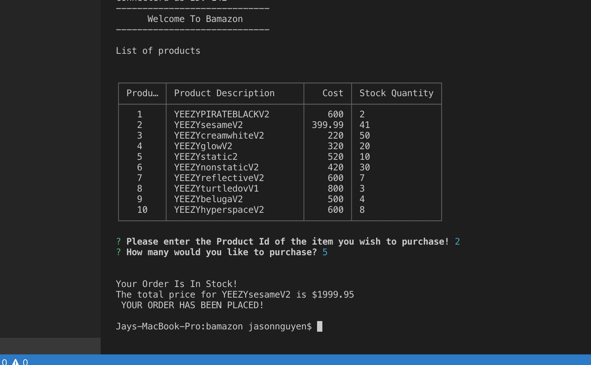
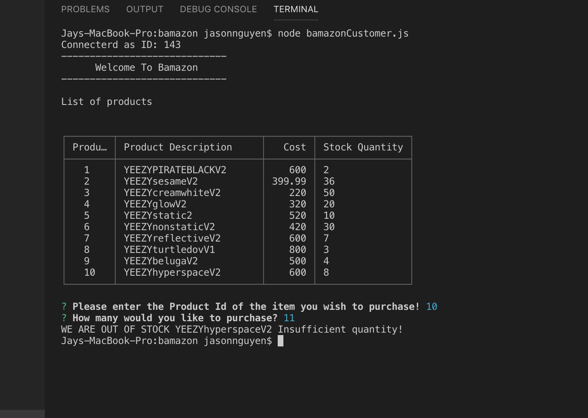

# bamazon
 * Challenge #1: Customer View (Minimum Requirement)

 * Create a MySQL Database called bamazon.

 * Then create a Table inside of that database called products.

 * The products table should have each of the following columns:

 * item_id (unique id for each product)

 * product_name (Name of product)

 * department_name

 * price (cost to customer)

 * stock_quantity (how much of the product is available in stores)

 * =============================================

* order is placed
 *  

* Insufficient stock
*  

